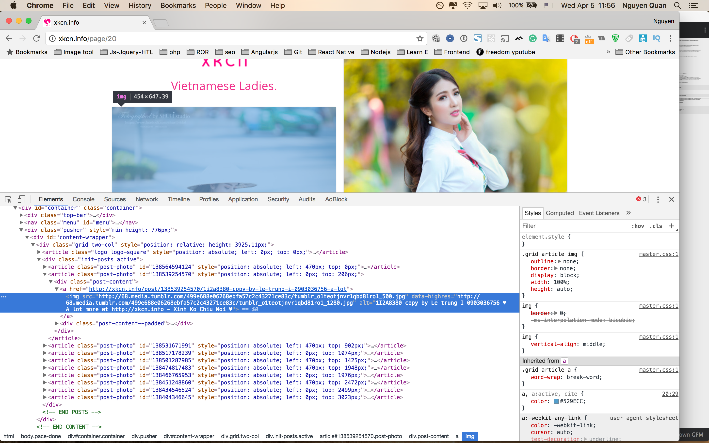

Random Photos
=====================

[](https://codeclimate.com/github/minhquan4080/random-photos)
[](https://codeclimate.com/github/minhquan4080/random-photos/coverage)
[](https://codeclimate.com/github/minhquan4080/random-photos)

## Introduction

This is a ruby application. It will help you get a radom photo with your config.

**Random Photos** is using `nokogiri` gem. You can see more about it at [nokogiri](https://github.com/sparklemotion/nokogiri)

**Why do I Write It ?**

As a developer, sometimes we feel stress and stuck with many bugs, deadline or with your boss. So, I write it with dutie is relax after I feel boring and can't resolve my stucks. 

## Getting Started

You must install **Ruby**, then clone this project into your local.

### Installing

`cd random-photos`

`bundle install`

### Get random photo

`./random.sh`

### Run test

`./test.sh`

### Config yourself

Go to `configs/` folder we can see 3 files:

- `sites.rb` : key name of websites.
- `pagination.rb` : page number for random.
- `at_css.rb` :  `url` and `selector of photo` match with key name while config at `sites.rb`. selector of photo is class or id of parent tag html. You can learn more at : [nokogiri](https://github.com/sparklemotion/nokogiri)

Example: 
I visit `http://xkcn.info/`. I have configs: 
`sites.rb` 

```
SITES = %w(
  xkcn # you can set any name
)
```


`pagination.rb`

```
PAGE_NUMBER = 30 # you can set any number
```



I find pages with url look like `http://xkcn.info/page/20`, `http://xkcn.info/page/22`. It have one struct is `http://xkcn.info/page/{number-page}`. So, I have url : `http://xkcn.info/page/`.

Then I right click on page. I see `article` tag with class `post-photo` is include `img` tag. So I have `selector: '.post-photo'`. If `post-photo` is id : `selector: '#post-photo'`. 

`at_css.rb`

```
AT_CSS = {
  'xkcn' => {
    url: 'http://xkcn.info/page/',
    selector: '.post-photo'
  }
}
```

Look good! Run `./random.sh` and enjoy :)

## Authors

- Libra


